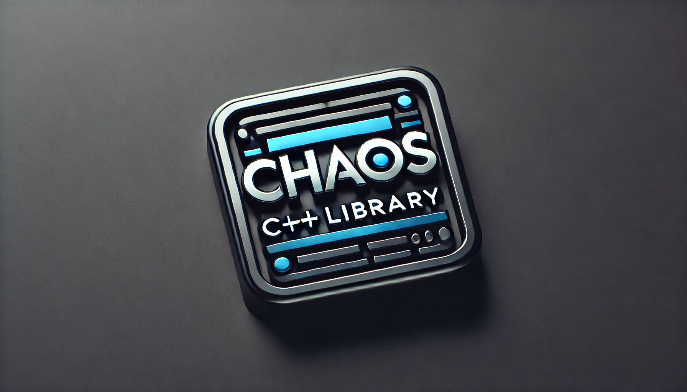

# Chaos

Chaos is a project dedicated for game development.
It is composed by a C++ library named **chaos** and several games or test executables

Internally, **premake5** is used to generate solutions:
* **Visual Studio 2022** on windows
* **Codelite** on linux

Chaos uses the following external libraries:
* OpenGL 4.5
* Glfw
* Glew
* Glm
* Imgui
* Boost
* Irrklang
* Nlohmann
* Freetype2
* Freeimage
* Tinyxml2
* ZLib
* Lua           (not really used yet)
* Assimp        (not really used yet)
* Glslang       (not really used yet)
* Vulkan        (not really used yet)

Some of thoses libraries are forked from the original depot, some are ZIPPED within Chaos files themselves

# CMake Installation

Even if not use in the premake process, external dependencies most be built and **CMake** is mandatory.
Here the link for installation

https://cmake.org/download/

# Vulkan installation
 
Vulkan has to be installed manually

Here is the link for **windows**:

https://vulkan.lunarg.com/sdk/home#windows

Here is the link for **linux**:

https://vulkan.lunarg.com/sdk/home#linux

# FBX Installation
 
not necessary yet

https://aps.autodesk.com/developer/overview/fbx-sdk
 
# Installation on windows

* First, you need to install git and its tools:

[https://git-scm.com/download/win](https://git-scm.com/download/win)

* Start git shell and get the depot from git (from the directory you want to install chaos):
```
git clone --recursive https://github.com/hubartstephane/Chaos.git
```
* Go within installation directory and install all dependencies (this will make all required libraries available):
```
install-extra-windows.bsh
```
* Generate the **Visual Studio 2022** solution with premake5:
```
generate-windows.bsh
```
* Start **Visual Studio 2022** and open the following solution:
```
solutions/vs2022/Death.sln
```
# Installation on linux

* First, you need to install git and its tools:

```
sudo apt install git
```

* Then get the depot from git (from the directory you want to install chaos)

```
git clone --recursive https://github.com/hubartstephane/Chaos.git
```
* Go within installation directory and install all dependencies (this will make all required libraries available):

```
install-extra-linux.bsh -lib
install-extra-linux.bsh -exe
install-extra-linux.bsh -tools                    (this is not mandatory)
```

* Generate the **Codelite** solution with premake5:
```
generate-linux.bsh
```
* Start **Codelite** and open the following solution:
```
solutions/codelite/Death.workspace
```
